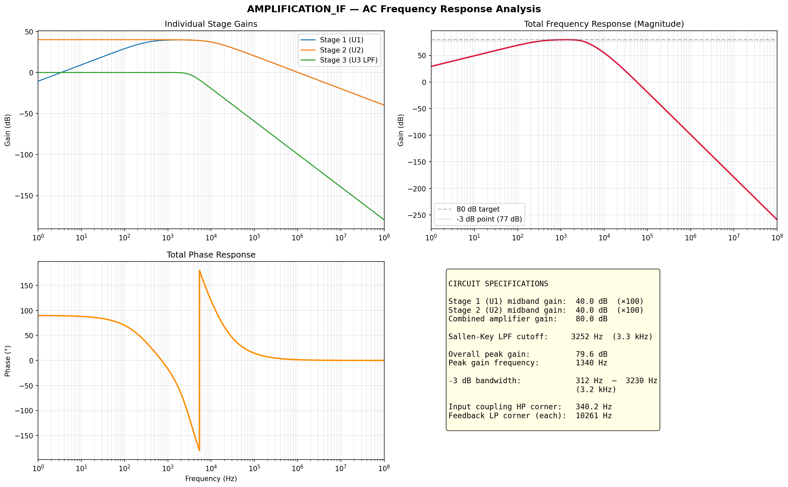

# Doppler radar using STM32 — End-to-End 24.125 GHz Radar Signal Chain

I built this project as a complete Doppler radar pipeline around the **STM32F767ZI**, from the **analog front-end** all the way to **real-time PC analysis**.

It includes:

- analog IF signal acquisition
- embedded ADC/DMA + FFT processing on STM32
- local OLED status display
- UDP Ethernet streaming to PC
- a real-time scope app (`pc_scope`)
- an advanced analyzer app (`pc_analyzer`) with FFT/CFAR/Kalman tracking

## Project overview

I measure Doppler shifts from a 24.125 GHz radar front-end and estimate target speed in real time.

Processing chain:

`Analog front-end (IF/baseband)`  
`-> STM32 ADC1 @ 100 kHz (DMA circular)`  
`-> half/full DMA callbacks (1024-sample hops)`  
`-> embedded buffering and metrics`  
`-> UDP fragmentation + Ethernet transmission (port 5555)`  
`-> PC reassembly + sliding window`  
`-> Hann + FFT + CFAR + robustification + Kalman`  
`-> live UI (scope / FFT / spectrogram / tracks)`  
`+ local OLED feedback`

## Visual presentation

### Hardware setup


*Complete bench setup with radar front-end, STM32F767ZI platform, and measurement chain.*

### Analog front-end schematic / amplification stage


*Analog conditioning stage used before ADC sampling (gain/filtering path).*

### Frequency response



*Measured frequency response of the front-end signal conditioning path.*

### Demo video

[](https://youtu.be/E4GLmaZWygU)

*Click the image to watch the live scope/analyzer demonstration on YouTube.*

## Embedded firmware (STM32)

Main firmware file: `Core\Src\main.c`

Main blocks implemented:

- `ADC1 + DMA2 Stream0` continuous acquisition
- `TIM2` trigger at `FS = 100000 Hz`
- embedded FFT path (`FFT_SIZE = 4096`)
- Doppler-to-speed conversion
- UDP hop streaming on port `5555`
- UART3 compatibility output
- SSD1306 OLED rendering over I2C1
- DAC + TIM4 generation path kept in the project

Key runtime constants:

- `ADC_BUF_SIZE = 2048`
- `FFT_SIZE = 4096`
- `FS = 100000.0f`
- `MIN_BIN = 2`, `MAX_BIN = 250`

## PC applications

### `pc_scope`

Source: `pc_scope\radar_scope.cpp`

I use this tool for fast bench visualization:

- time-domain waveform
- FFT panel
- spectrogram panel
- trigger-style observation

### `pc_analyzer`

Source: `pc_analyzer\radar_analyzer.cpp`

This is my advanced DSP toolchain:

- UDP hop reassembly
- sliding analysis window
- configurable FFT sizes
- CA-CFAR detection
- notch / adaptive floor controls
- peak extraction and confidence metrics
- Kalman filtered speed tracking

## Repository structure

```text
Core\Src\main.c                     # STM32 firmware core logic
Core\Src\ssd1306.c                  # OLED driver implementation
Core\Inc\ssd1306.h                  # OLED driver interface
Drivers\                            # STM32 HAL/CMSIS stack
Middlewares\                        # Middleware components
pc_scope\                           # Scope application (ImGui/OpenGL/GLFW)
pc_analyzer\                        # Analyzer application (UDP + DSP + UI)
Documentation_main_c.tex            # Firmware technical documentation
Documentation_pc_analyzer_fft.tex   # FFT/DSP deep-dive documentation
projet_L3.ioc                       # CubeMX project config
```

## Build

### Firmware

I build and flash firmware from STM32CubeIDE using `projet_L3.ioc`.

### PC scope

```bat
cd pc_scope
build.bat
```

### PC analyzer

```bat
cd pc_analyzer
build.bat
```

## Network configuration (analyzer)

- STM32: `192.168.1.10`
- PC: `192.168.1.100`
- UDP port: `5555`

## Documentation

- `Documentation_main_c.tex` / PDF
- `Documentation_pc_analyzer_fft.tex` / PDF

## About (FR)

Chaîne complète radar Doppler 24,125 GHz sur STM32F767ZI : acquisition analogique, ADC/DMA + FFT embarquée, affichage OLED, streaming UDP Ethernet, oscilloscope PC et analyseur DSP avancé avec CFAR/Kalman.

## Topics

`stm32` `stm32f7` `stm32f767zi` `radar` `doppler-radar` `signal-processing` `fft` `cfar` `kalman-filter` `embedded-systems` `adc` `dma` `oled` `ethernet` `udp` `imgui` `glfw` `opengl` `cplusplus`
